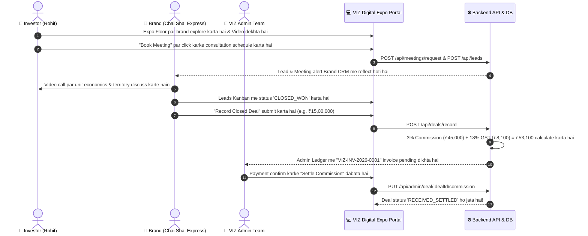

# 🚀 VIZ INDIA DIGITAL EXPO
> **24/7 Digital B2B Franchise Marketplace, AI Matchmaking & Deal Reconciliation Platform**

---

## 📌 1. Project Overview (Yeh App Kya Hai?)

**VIZ India Digital Expo** ek 24/7 virtual B2B marketplace hai jo India ke prospective **Investors / Franchisees** ko verified **Brands / Franchisors** se connect karta hai. 

Jaise physical exhibition halls (e.g. Pragati Maidan) mein Franchise Expos lagte hain, yeh platform uska poora **digital, interactive aur automated ecosystem** provide karta hai:
- Investors video pitch reels dekh sakte hain aur 2–4 brands ko side-by-side compare kar sakte hain.
- Har brand ke paas ek **Grounded AI Bot** hota hai jo sirf verified facts (investment, ROI, FOFO model) batata hai.
- Investors direct **1-on-1 discovery video meetings** schedule kar sakte hain.
- Brands ke paas ek built-in **Leads CRM Kanban Board** hota hai.
- Jab bhi koi franchise deal close hoti hai, VIZ system automatically **3% Platform Success Fee + 18% GST** ka invoice aur settlement ledger generate karta hai.

---

## 🏗️ 2. Project Architecture (Folder Structure & Tech Stack)

```text
New App/
├── client-portal/     👉 Web Portal (React 18, Vite, Tailwind CSS, Lucide Icons, Framer Motion)
├── server/            👉 Backend API (Node.js, Express, TypeScript, Socket.io, MongoDB/InMemory)
├── mobile-app/        👉 Mobile App (React Native, Expo Router, Lucide-react-native)
└── README.md          👉 Documentation & Functionality Guide
```

### 🛠️ Tech Stack:
| Component | Technologies Used |
| :--- | :--- |
| **Frontend Web Portal** | React 18, Vite, TypeScript, Tailwind CSS, Lucide Icons, Framer Motion, Axios, Socket.io Client |
| **Backend Server** | Node.js, Express.js, TypeScript, Socket.io, JWT Authentication, Mongoose (MongoDB), In-Memory Store Fallback |
| **Mobile Application** | React Native, Expo Router (SDK 52+), Lucide-react-native |
| **Database** | MongoDB (Mongoose ORM) + Automatic In-Memory Store Fallback |

---

## 👥 3. Three User Personas & Complete Functionality

Top Navigation Bar par **1-Click Persona Quick Switcher** laga hai:

### 1️⃣ Investor Persona (e.g., Rohit Sharma)
- **🎬 Expo Floor ([InvestorExpoView.tsx](client-portal/src/pages/InvestorExpoView.tsx)):**
  - High-ticket video pitch reels & brand banners.
  - Multi-category filter (Food, Retail, Education, EV, Healthcare, Fitness, Beauty).
  - Budget bracket filter (`< ₹5L`, `₹5–10L`, `₹10–25L`, `₹25–50L`, `₹50L–1Cr`, `₹1Cr+`).
- **🤖 Grounded Brand AI Assistant ([AIAssistantModal.tsx](client-portal/src/components/AIAssistantModal.tsx)):**
  - Brand ke official AI Bot se sawal poochhna (e.g. *Franchise fee kitni hai?*, *Chandigarh me territory available hai?*).
  - Hallucination-free (sirf brand-approved data se answer karta hai).
- **✨ 5-Step AI Matchmaking ([InvestorProfileSetupModal.tsx](client-portal/src/components/InvestorProfileSetupModal.tsx)):**
  - Investor apni location, budget, preferred category, space (sq.ft.), aur business experience enter karta hai.
  - AI algorithm har brand ke liye **Match Score (%)** calculate karta hai.
- **⚖️ Side-by-Side Brand Comparison ([CompareModal.tsx](client-portal/src/components/CompareModal.tsx)):**
  - 2 se 4 brands ko ek table mein compare karna (Investment, Franchise Fee, Royalty %, Space required, ROI period).
- **📅 Discovery Meetings ([MyMeetingsView.tsx](client-portal/src/pages/MyMeetingsView.tsx)):**
  - Brand leadership ke saath 1-on-1 video call book karna.
  - **"Join Video Call Room"** button se direct secure video call open hoti hai.
- **🤝 My Deals ([MyDealsView.tsx](client-portal/src/pages/MyDealsView.tsx)):**
  - Signed franchise agreements, token payments, aur deal status track karna.

---

### 2️⃣ Brand Admin Persona (e.g., Chai Shai Express / Burger Blast)
- **🏢 Brand Portal & CRM ([BrandPortalView.tsx](client-portal/src/pages/BrandPortalView.tsx)):**
  - **Leads Kanban Board:** High-intent investors ke leads track karna:
    $$\text{NEW} \longrightarrow \text{CONTACTED} \longrightarrow \text{MEETING\_SCHEDULED} \longrightarrow \text{NEGOTIATION} \longrightarrow \text{CLOSED\_WON}$$
  - Investor ka complete snapshot (Name, Phone, City, Budget, Space available).
- **🧠 AI Knowledge Base Manager:**
  - Naye FAQs aur Financial breakups upload karna taaki AI bot update ho sake.
- **🏆 Record Closed Deal:**
  - Franchise agreement finalize hone par deal value enter karke submit karna.

---

### 3️⃣ VIZ Super Admin (Platform Governance & Commission)
- **👑 Admin Command Center ([AdminDashboardView.tsx](client-portal/src/pages/AdminDashboardView.tsx)):**
  - Platform-wide Gross Deal Volume, Active Brands, Registered Investors monitor karna.
  - **Brand KYC & Verification Queue:** Naye brands ko verify aur feature karna.
- **💰 3% Deal Success Fee & GST Engine:**
  - Har closed franchise deal par automatic calculation:
    $$\text{VIZ Success Fee (3\%)} = \text{Total Deal Value} \times 0.03$$
    $$\text{GST (18\%)} = \text{VIZ Success Fee} \times 0.18$$
    $$\text{Total Invoice Amount} = \text{Success Fee} + \text{GST}$$
  - **1-Click Settlement:** Bank RTGS / UTR number enter karke deal status ko `RECEIVED_SETTLED` mark karna.

---

## 🔄 4. Complete Deal Lifecycle Flow (Deal Kaise Hoti Hai?)



---

## 📱 5. Mobile App Features (`mobile-app`)

Investors ke smartphone ke liye **React Native (Expo)** app:
- **🎬 Reels Style Video Pitch Showcase:** Full-screen vertical swipe (Instagram Reels / Shorts style) franchise pitches.
- **🏠 Category & Budget Quick Filters:** Ek tap me brands filter karna.
- **📅 Mobile Discovery Calls:** Phone se direct video meetings join karna.
- **🤝 Deals & Profile:** Matchmaking preferences aur signed deals check karna.

---

## 🔌 6. API Endpoints Reference

### 🔐 Authentication (`/api/auth`)
| Method | Endpoint | Description |
| :--- | :--- | :--- |
| `POST` | `/api/auth/demo-login` | 1-Click login for `INVESTOR`, `BRAND`, or `ADMIN` |
| `POST` | `/api/auth/request-otp` | Request 6-digit mobile OTP |
| `POST` | `/api/auth/verify-otp` | Verify OTP & register/login user |
| `GET` | `/api/auth/me` | Fetch active user profile & JWT validation |

### 🏢 Brands (`/api/brands`)
| Method | Endpoint | Description |
| :--- | :--- | :--- |
| `GET` | `/api/brands` | Fetch all brands (supports category, budget, verified filters) |
| `POST` | `/api/brands` | Create a new franchise brand booth |
| `GET` | `/api/brands/:id` | Fetch single brand details & approved knowledge base |
| `PUT` | `/api/brands/:brandId/booth` | Update brand booth details (Auth required) |
| `POST` | `/api/brands/:brandId/kb` | Add new Knowledge Base chunk for Brand AI |

### 📅 Meetings (`/api/meetings`)
| Method | Endpoint | Description |
| :--- | :--- | :--- |
| `POST` | `/api/meetings/request` | Book 1-on-1 discovery video call |
| `GET` | `/api/meetings` | Get all scheduled meetings for logged-in user |
| `PUT` | `/api/meetings/:meetingId/status` | Update meeting status (`ACCEPTED`, `COMPLETED`, `CANCELLED`) |

### 📋 Leads CRM (`/api/leads`)
| Method | Endpoint | Description |
| :--- | :--- | :--- |
| `POST` | `/api/leads` | Create new lead from expo floor enquiry |
| `GET` | `/api/leads/brand/:brandId` | Fetch leads pipeline for Brand Kanban |
| `PUT` | `/api/leads/:leadId/stage` | Move lead to next stage (`NEW` ➡️ `CLOSED_WON`) |

### 💵 Deals & Commission (`/api/deals`)
| Method | Endpoint | Description |
| :--- | :--- | :--- |
| `POST` | `/api/deals/record` | Record closed franchise deal & generate 3% invoice |
| `GET` | `/api/deals/brand/:brandId` | Fetch closed deals for a brand |

### 👑 Admin Management (`/api/admin`)
| Method | Endpoint | Description |
| :--- | :--- | :--- |
| `GET` | `/api/admin/overview` | Platform gross statistics & recent deals |
| `PUT` | `/api/admin/brand/:brandId/verify` | Verify or feature a brand |
| `PUT` | `/api/admin/deal/:dealId/commission` | Settle 3% success fee invoice |

### 🤖 Grounded AI RAG (`/api/ai`)
| Method | Endpoint | Description |
| :--- | :--- | :--- |
| `POST` | `/api/ai/ask-brand` | Query brand AI assistant with strict knowledge-base grounding |

---

## 🍃 7. Database & MongoDB Synchronization

App mein **Dual Database Architecture** hai:
1. **In-Memory Store:** Agar local me MongoDB installed na ho, tab bhi poori app seamlessly run hoti hai.
2. **MongoDB Mongoose Models:** `Brand`, `User`, `InvestorProfile`, `Lead`, `Meeting`, `DealCommission`, `BrandKnowledgeBase`.

### 🔄 Data Ko MongoDB Mein Sync Kaise Karein?
1. [`server/.env`](server/.env) mein apna MongoDB connection string dalein:
   ```env
   MONGODB_URI=mongodb://localhost:27017/viz_digital_expo
   # Ya MongoDB Atlas Cloud URI:
   # MONGODB_URI=mongodb+srv://<username>:<password>@cluster.mongodb.net/viz_digital_expo
   ```
2. Terminal mein sync command chalayein:
   ```powershell
   cd server
   npm run sync:mongo
   ```
   > Yeh script current live brands, users, leads, meetings aur closed deals ko direct MongoDB collections mein dump kar deta hai!

---

## 🚀 8. Project Ko Run Kaise Karein? (Step-by-Step)

### Step 1: Backend Server Start Karein
Terminal 1 mein:
```powershell
cd "c:\Users\jhasa\OneDrive\Desktop\New App\server"
npm run dev
```
> Server `http://localhost:5000` par run hoga.

### Step 2: Web Client Portal Start Karein
Terminal 2 mein:
```powershell
cd "c:\Users\jhasa\OneDrive\Desktop\New App\client-portal"
npm run dev
```
> Browser mein `http://localhost:5173` kholein.

### Step 3 (Optional): Mobile App Start Karein
Terminal 3 mein:
```powershell
cd "c:\Users\jhasa\OneDrive\Desktop\New App\mobile-app"
npx expo start
```
> Phone ke Expo Go app se QR code scan karke live mobile app test karein.

---

## 📁 9. File Structure Map

```text
New App/
├── README.md                              <-- Poori documentation & functionality guide
├── server/
│   ├── src/
│   │   ├── config/database.ts             <-- MongoDB connection & in-memory fallback
│   │   ├── controllers/                   <-- Auth, Brand, Lead, Meeting, Deal, Admin controllers
│   │   ├── models/                        <-- Mongoose Schemas (Brand, User, Deal, Lead, etc.)
│   │   ├── routes/                        <-- Express API routes
│   │   ├── seed/
│   │   │   ├── seedData.ts                <-- Initial seed script
│   │   │   └── syncToMongo.ts             <-- MongoDB synchronization engine
│   │   ├── services/
│   │   │   ├── aiRagService.ts            <-- Grounded AI RAG engine
│   │   │   ├── commissionService.ts       <-- 3% Success fee & 18% GST calculator
│   │   │   └── matchmakingService.ts      <-- 5-parameter investor match score engine
│   │   ├── store/
│   │   │   ├── inMemoryStore.ts           <-- Active clean in-memory store
│   │   │   └── inMemoryStore.backup.ts    <-- Backup of initial data
│   │   └── server.ts                      <-- Express & Socket.io server entry point
├── client-portal/
│   ├── src/
│   │   ├── components/
│   │   │   ├── AIAssistantModal.tsx       <-- Grounded brand chat popup
│   │   │   ├── BrandReelCard.tsx          <-- Video pitch reel card
│   │   │   ├── CompareModal.tsx           <-- 2-4 Brand side-by-side comparison
│   │   │   ├── InvestorProfileSetupModal.tsx <-- 5-Step AI matchmaking wizard
│   │   │   ├── MeetingRequestModal.tsx    <-- Book discovery call popup
│   │   │   └── Navbar.tsx                 <-- Top navbar & Persona Switcher
│   │   ├── context/AuthContext.tsx        <-- Auth state & persona switcher
│   │   ├── pages/
│   │   │   ├── AdminDashboardView.tsx     <-- Super Admin & 3% commission reconciliation
│   │   │   ├── BrandDetailView.tsx        <-- Deep-dive brand specifications & financials
│   │   │   ├── BrandPortalView.tsx        <-- Brand Leads Kanban & Deal recording
│   │   │   ├── InvestorExpoView.tsx       <-- Main expo floor & brand showcase
│   │   │   ├── MyDealsView.tsx            <-- Investor signed deals & tokens
│   │   │   └── MyMeetingsView.tsx         <-- Investor scheduled video discovery calls
│   │   ├── services/api.ts                <-- Axios client for all backend endpoints
│   │   ├── App.tsx                        <-- Main app routing & modal container
│   │   ├── main.tsx                       <-- React root mount point
│   │   └── index.css                      <-- Tailwind CSS & custom design tokens
└── mobile-app/
    ├── app/
    │   ├── (tabs)/
    │   │   ├── index.tsx                  <-- Mobile home with category & budget filters
    │   │   ├── showcase.tsx               <-- Reels-style vertical video pitches
    │   │   ├── meetings.tsx               <-- Mobile video call meetings
    │   │   ├── deals.tsx                  <-- Mobile deals tracker
    │   │   └── profile.tsx                <-- Investor profile & settings
    │   └── _layout.tsx                    <-- Expo router root layout
```

---

*VIZ India Digital Expo — Transforming Indian Franchise Expansion through Technology & AI.*
