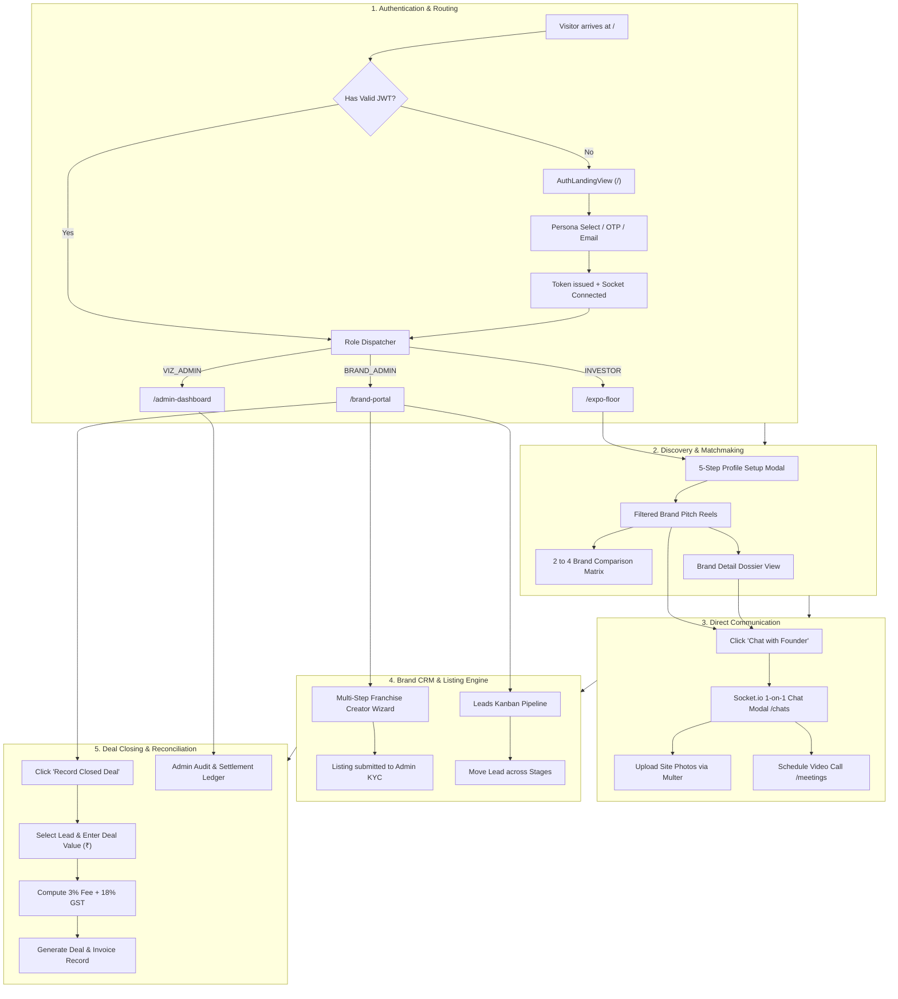

# 🚀 VIZ INDIA DIGITAL EXPO
> **24/7 Digital B2B Franchise Marketplace, AI Matchmaking & Deal Reconciliation Platform**  
> *Transforming how Indian Brands expand and Investors discover verified franchise opportunities.*

---

## 📑 Table of Contents
1. [🌟 Executive Summary & Vision (Why We Built This?)](#-1-executive-summary--vision-why-we-built-this)
2. [🎯 The Problem We Are Solving](#-2-the-problem-we-are-solving)
3. [💡 The Solution: What is VIZ India Digital Expo?](#-3-the-solution-what-is-viz-india-digital-expo)
4. [🚀 How the App Launches & Bootstrap Lifecycle](#-4-how-the-app-launches--bootstrap-lifecycle)
   - [4.1 Backend Initialization & Resilient Startup](#41-backend-initialization--resilient-startup)
   - [4.2 Frontend Mounting & State Restoration](#42-frontend-mounting--state-restoration)
   - [4.3 Real-Time WebSocket Handshake & Presence Sync](#43-real-time-websocket-handshake--presence-sync)
   - [4.4 Role-Based Default Landing Redirection](#44-role-based-default-landing-redirection)
5. [🎨 Branded Landing Page Architecture & Visual Experience](#-5-branded-landing-page-architecture--visual-experience)
   - [5.1 3D Geometric Crystal Emblem (`VizLogo.tsx`)](#51-3d-geometric-crystal-emblem-vizlogotsx)
   - [5.2 Hero Presentation & Live Market Metrics](#52-hero-presentation--live-market-metrics)
   - [5.3 1-Click Persona Switcher Bar](#53-1-click-persona-switcher-bar)
   - [5.4 Multi-Tab Enterprise Authentication Suite](#54-multi-tab-enterprise-authentication-suite)
   - [5.5 Public Guest Preview Mode (`/preview`)](#55-public-guest-preview-mode-preview)
6. [🔄 Complete Operational Workflows (End-to-End Lifecycles)](#-6-complete-operational-workflows-end-to-end-lifecycles)
   - [6.1 Full System Flow Diagram](#61-full-system-flow-diagram)
   - [6.2 Phase 1: Authentication & Dynamic Route Guarding](#62-phase-1-authentication--dynamic-route-guarding)
   - [6.3 Phase 2: Investor Discovery, Matchmaking & Comparison Flow](#63-phase-2-investor-discovery-matchmaking--comparison-flow)
   - [6.4 Phase 3: Brand Franchise Creation & Leads Kanban Flow](#64-phase-3-brand-franchise-creation--leads-kanban-flow)
   - [6.5 Phase 4: Direct Real-Time Human Chat & Meeting Flow](#65-phase-4-direct-real-time-human-chat--meeting-flow)
   - [6.6 Phase 5: Deal Closing, 3% Fee Invoicing & Settlement Flow](#66-phase-5-deal-closing-3-fee-invoicing--settlement-flow)
7. [🛡️ Enterprise Security Architecture & Data Protection](#-7-enterprise-security-architecture--data-protection)
   - [7.1 Role-Based Access Control (RBAC) & Guards](#71-role-based-access-control-rbac--guards)
   - [7.2 Token Authentication & Session Interceptors](#72-token-authentication--session-interceptors)
   - [7.3 Tenant Scoping & Brand Ownership Verification](#73-tenant-scoping--brand-ownership-verification)
   - [7.4 Sliding-Window Rate Limiting & Brute-Force Defense](#74-sliding-window-rate-limiting--brute-force-defense)
   - [7.5 File Upload Sanitization & Isolated Storage](#75-file-upload-sanitization--isolated-storage)
   - [7.6 Non-Blocking Resilient Database Layer](#76-non-blocking-resilient-database-layer)
   - [7.7 Immutable Deal Commission Audit Trail](#77-immutable-deal-commission-audit-trail)
8. [✨ Core Features & Platform Modules](#-8-core-features--platform-modules)
   - [8.1 24/7 Virtual Expo Floor & Video Pitch Reels](#81-247-virtual-expo-floor--video-pitch-reels)
   - [8.2 Real-Time Direct Messaging System (Socket.io)](#82-real-time-direct-messaging-system-socketio)
   - [8.3 Live In-App & Push Notification Center](#83-live-in-app--push-notification-center)
   - [8.4 Multi-Brand Comparison Matrix (2 to 4 Brands)](#84-multi-brand-comparison-matrix-2-to-4-brands)
   - [8.5 3% Platform Success Fee & GST Reconciliation Engine](#85-3-platform-success-fee--gst-reconciliation-engine)
   - [8.6 Mobile Application (React Native & Expo Router)](#86-mobile-application-react-native--expo-router)
9. [🏗️ Technical Architecture & Directory Layout](#-9-technical-architecture--directory-layout)
10. [📊 Database Schemas & Data Models](#-10-database-schemas--data-models)
11. [📡 REST API & Socket.io Event Reference](#-11-rest-api--socketio-event-reference)
12. [⚡ Quick Start & Setup Guide](#-12-quick-start--setup-guide)
13. [🔑 Default Demo Credentials (1-Click Personas)](#-13-default-demo-credentials-1-click-personas)
14. [💼 Business & Monetization Model](#-14-business--monetization-model)

---

## 🌟 1. Executive Summary & Vision (Why We Built This?)

India is experiencing an unprecedented entrepreneurial revolution. The Indian franchise ecosystem is valued at over **$50+ Billion** and is compounding at **30%+ CAGR**. From Tier-1 metros (Delhi NCR, Mumbai, Bangalore) to Tier-2, 3, and 4 growth corridors (Chandigarh, Indore, Surat, Jaipur, Lucknow), lakhs of aspiring entrepreneurs and HNIs (High Net-Worth Individuals) are looking to acquire proven, scalable franchise units in Food & Beverages (QSR), Electric Vehicle (EV) Charging Networks, Fitness Centers, Pre-Schools, and Healthcare/Salons.

Despite this explosive demand, the traditional franchise discovery, evaluation, and deal-closing infrastructure in India is largely offline, fragmented, and inefficient.

### 🎯 Our Mission:
> **"To democratize franchise entrepreneurship across India by engineering a 24/7, frictionless digital expo floor where verified brands and serious investors discover each other, negotiate directly through real-time human communication, and close deals with complete financial transparency and automated reconciliation."**

---

## 🎯 2. The Problem We Are Solving

| Traditional / Physical Expo Limitations | How VIZ India Digital Expo Solves It |
| :--- | :--- |
| **Short-Lived & Costly Events:** Physical expos (e.g. Pragati Maidan, Hitex) last only 2–3 days. Brands spend ₹5 Lakh to ₹20+ Lakh per booth, while regional investors face high travel and lodging costs. | **24/7/365 Always-On Virtual Expo:** Zero physical overhead. Accessible anytime from Web, Tablet, or Mobile app, removing all geographical barriers for Tier-2/3/4 investors. |
| **Unverified Claims & Inflated Financials:** Offline brokers frequently exaggerate ROI promises, concealing royalties, inventory markups, and actual payback timelines. | **Standardized KYC & Verified Dossiers:** Strict administrative KYC verification. Standardized breakdown of Franchise Fees, Capex, FOFO/FOCO models, Carpet Area, and audited historical ROI disclosures. |
| **Lost Leads & Broken Follow-ups:** Paper brochures and business cards get lost; industry data reveals over 70% of expo leads go completely cold within 48 hours. | **Automated CRM & Real-Time Direct Chat:** Inquiries are captured instantly in the brand's Kanban pipeline; investors and brand founders connect live via Socket.io messaging. |
| **Untracked Deals & Commission Leakage:** Organizers lack visibility into deals closed post-event, leading to zero follow-through and lost revenue. | **Automated 3% Success Fee & GST Engine:** Built-in deal recording wizard with automated 3% platform commission + 18% GST calculation, generating audit-ready invoices and settlement tracking. |
| **Impersonal AI Bot Dead-Ends:** Rigid bots frustrate high-ticket investors when discussing multi-lakh capital investments. | **Direct Human-to-Human Communication:** Replaced bots with direct **Investor ↔ Brand Head / Founder** live chat with site photo uploads, presence detection, and 1-on-1 video call booking. |

---

## 💡 3. The Solution: What is VIZ India Digital Expo?

**VIZ India Digital Expo** is a full-stack, enterprise-grade B2B digital marketplace platform engineered specifically for the Indian franchise and commercial expansion landscape.

It unifies three key stakeholder groups:
1. **Investors / Franchisees:** Individuals, business partners, or corporate entities seeking profitable, vetted franchise opportunities tailored to their capital, city, and operational preference.
2. **Brands / Franchisors:** Growing brands seeking nationwide expansion across FOFO (*Franchise Owned, Franchise Operated*) or FOCO (*Franchise Owned, Company Operated*) formats without relying on fragmented broker networks.
3. **Platform Administrators (VIZ Operations):** Verifying brand legitimacy, moderating listings, and overseeing deal commissions and reconciliation ledgers.

---

## 🚀 4. How the App Launches & Bootstrap Lifecycle

When the application is started, a coordinated backend and frontend bootstrapping pipeline initializes the runtime, establishes secure channels, restores persisted authentication, and routes users according to their persona.

```text
┌─────────────────────────────────────────────────────────────────────────┐
│                       APPLICATION BOOTSTRAP PIPELINE                    │
└────────────────────────────────────┬────────────────────────────────────┘
                                     │
         ┌───────────────────────────┴───────────────────────────┐
         ▼                                                       ▼
┌─────────────────────────────────┐             ┌─────────────────────────────────┐
│         BACKEND (Node.js)       │             │       FRONTEND (React/Vite)     │
├─────────────────────────────────┤             ├─────────────────────────────────┤
│ 1. Load .env config & PORT      │             │ 1. Mount React DOM root         │
│ 2. connectDB() with fallback    │             │ 2. Wrap App with Providers:     │
│ 3. Run auto-seed if empty       │             │    BrowserRouter                │
│ 4. Initialize Express & CORS    │             │    AuthProvider                 │
│ 5. Mount static /uploads/       │             │    SocketProvider               │
│ 6. Mount REST API route handlers│             │ 3. Read viz_auth_token from LS  │
│ 7. Attach Socket.io to HTTP     │             │ 4. Call /api/auth/me to verify  │
│ 8. Register Real-Time listeners │             │ 5. Emit 'user:online' to Socket │
│ 9. Server listens on Port 5000  │             │ 6. Evaluate Role-Based Route    │
└─────────────────────────────────┘             └─────────────────────────────────┘
```

### 4.1 Backend Initialization & Resilient Startup
1. **Environment Config:** Loads environment variables (`PORT`, `MONGO_URI`, `JWT_SECRET`, `CLIENT_URL`) via `dotenv`.
2. **Resilient Database Handshake (`database.ts`):** 
   - Attempts connection to MongoDB with `serverSelectionTimeoutMS: 5000` and `bufferCommands: false`.
   - **Zero-Downtime Non-Blocking Fallback:** If MongoDB is offline or unavailable during local development, the backend automatically activates `inMemoryStore.ts`. The server continues operating without crashing or hanging requests.
3. **Database Seeding (`seedData.ts`):** On startup, if database collections are empty, the seeder automatically populates verified brands (Burger Blast, Chai Shai Express, VoltCharge EV, FitPulse Gym, KidZone Pre-School, GlowUp Salon), sample knowledge chunks, demo users, active leads, scheduled meetings, and settled deals.
4. **Middleware Attachment:** Attaches CORS (allowing cross-origin requests from client portal and mobile app), JSON payload body parsers with a 10MB limit for image handling, and static file serving for uploaded photos (`/uploads`).
5. **Route Registration:** Mounts modular route handlers for `/api/auth`, `/api/brands`, `/api/chats`, `/api/notifications`, `/api/deals`, `/api/leads`, `/api/meetings`, `/api/upload`, and `/api/admin`.
6. **Socket.io Real-Time Dispatcher:** Attaches WebSocket listeners to the HTTP server instance, handling connection authentication, online presence tracking, room subscriptions, typing indicators, and message broadcasts.

### 4.2 Frontend Mounting & State Restoration
1. **DOM Hydration:** `client-portal/src/main.tsx` mounts the application into the root element.
2. **Provider Hierarchy:**
   ```tsx
   <BrowserRouter>
     <AuthProvider>
       <SocketProvider>
         <MainApp />
       </SocketProvider>
     </AuthProvider>
   </BrowserRouter>
   ```
3. **Deterministic Auth Restoration:**
   - On initialization, `AuthContext.tsx` reads `localStorage.getItem('viz_auth_token')`.
   - If a token exists, it invokes `/api/auth/me`. Upon successful verification, the user object and role are populated into memory.
   - If the token is invalid or expired, `localStorage.removeItem('viz_auth_token')` is triggered, and a clean logout event resets the state.

### 4.3 Real-Time WebSocket Handshake & Presence Sync
1. Once the user is authenticated, `SocketContext.tsx` establishes a duplex connection with the backend (`http://localhost:5000`).
2. The client emits `socket.emit('user:online', user._id)` to declare active presence.
3. The server joins the socket to a private user room (`user_<userId>`) for targeted push notifications and adds the socket ID to the `onlineUsers` map.
4. A `presence:update` event is broadcast to all clients, dynamically illuminating the **green live presence dot** next to the user's avatar across the platform.

### 4.4 Role-Based Default Landing Redirection
When navigating to the root path (`/`), the app checks the user's authenticated session:
- **Unauthenticated Users:** Display the full-screen interactive **Launch & Authentication Portal** (`AuthLandingView.tsx`).
- **Authenticated `INVESTOR`:** Automatically redirected to the **Virtual Expo Floor** (`/expo-floor`).
- **Authenticated `BRAND_ADMIN`:** Automatically redirected to the **Brand Portal & CRM** (`/brand-portal`).
- **Authenticated `VIZ_ADMIN`:** Automatically redirected to the **Admin Command Center** (`/admin-dashboard`).

---

## 🎨 5. Branded Landing Page Architecture & Visual Experience

The Launch & Landing Gateway (`client-portal/src/pages/AuthLandingView.tsx`) serves as the primary entrance to the platform. It is engineered with high-impact visual aesthetics, trust indicators, and quick-login capabilities.

```text
┌────────────────────────────────────────────────────────────────────────┐
│                        VIZ INDIA LAUNCH PORTAL (/)                     │
├────────────────────────────────────────────────────────────────────────┤
│  [💎 3D VizLogo]   VIZ INDIA DIGITAL EXPO        [Explore as Guest ↗]  │
│                                                                        │
│  "India's 24/7 Digital B2B Franchise Marketplace & Deal Platform"      │
│  ₹450Cr+ Closed GMV  │  120+ Brands  │  4,500+ Qualified Investors     │
│                                                                        │
│  ┌──────────────────────────────────────────────────────────────────┐  │
│  │ ⚡ 1-Click Persona Testing Bar:                                   │  │
│  │ [🧑‍💼 Investor: Rohit]  [🏢 Brand Head: Vikram]  [🛡️ VIZ Admin]    │  │
│  └──────────────────────────────────────────────────────────────────┘  │
│                                                                        │
│  ┌───────────────────────────────┬──────────────────────────────────┐  │
│  │   LOGIN & REGISTRATION TABS   │     LIVE PLATFORM SHOWCASE       │  │
│  │                               │                                  │  │
│  │  [Demo] [Mobile OTP] [Email]  │  🎬 Featured Video Reels         │  │
│  │                               │  🏷️ Food, EV, Fitness, Retail   │  │
│  │  Enter credentials / OTP...   │  🔒 Verified KYC Assured         │  │
│  │  [🚀 Enter Platform]          │  🤝 3% Transparent Success Fee   │  │
│  └───────────────────────────────┴──────────────────────────────────┘  │
└────────────────────────────────────────────────────────────────────────┘
```

### 5.1 3D Geometric Crystal Emblem (`VizLogo.tsx`)
- High-tech, faceted vector SVG emblem representing institutional trust, capital precision, and digital transformation.
- Integrated ambient cyan-indigo lighting gradients, metallic edges, and clean typography.

### 5.2 Clean Hero & Instant Guest Exploration (Amazon/Flipkart Style)
- **Zero Friction First Screen**: Clean hero with a single concise value proposition (*"Discover & Partner with India's Top Franchise Brands"*), an instant search and sector-filter bar, and a single "Sign In" button in the top navbar.
- **No Upfront Roadblocks**: Free of cluttered stat walls or forced multi-tab auth forms on first visit.
- **Immediate Expo Floor Access**: The complete verified franchise floor (6 brands) is visible and browsable right below the hero with zero login requirement.
- **Interactive Action Interception**: Guests can freely watch pitch reels, explore financial specs, and use the side-by-side comparison matrix. Only interactive actions (*Chat with Founder*, *Book Live Meeting*, *Save Brand*) prompt a lightweight login modal, returning the user to their active context upon completion.

### 5.3 Amazon-Style 2-Screen Minimal Onboarding (<10 Seconds)
- **Screen 1 (Single Identifier)**: One input field (*"Mobile number or email"*) + one **"Continue"** button. No upfront name, city, role, or budget questions.
- **Screen 2 (Minimal Credential)**:
  - If Email: Asks strictly for password (*"Enter your password"* for existing users, *"Set a password"* for new accounts).
  - If Phone: Sends 6-digit OTP with active 30s countdown timer and developer quick-fill helper.
- **Screen 3 (1-Click Post-Signup Role Selection)**:
  - Shown once right after a new account is registered: *"What brings you to VIZ India?"*
  - Two prominent cards: **"I want to invest"** (sets Investor role) and **"I want to list my brand"** (sets Brand Admin role).
- **Discreet Test Personas**: 1-click test accounts (Rohit Investor, Chai Sutta Brand, VIZ SuperAdmin) are tucked into an expandable drawer to avoid competing with real login.

### 5.4 Progressive Profiling (Ask Later, Only When Relevant)
- **Investor Matchmaking Profile**: 5-step profile setup (budget, city, FOFO/FOCO, space) never blocks entry to the expo floor. Every step includes a prominent **"Skip for now"** button.
- **Brand Admin Wizard**: Multi-step franchise listing wizard is accessed contextually from the Brand Portal via **"+ List your franchise"**, never forced upon initial signup.
- **Listing KYC**: Verification documents are submitted when publishing a franchise listing, not during initial account creation.

---

## 🔄 6. Complete Operational Workflows (End-to-End Lifecycles)

### 6.1 Full System Flow Diagram



### 6.2 Phase 1: Authentication & Dynamic Route Guarding
1. User requests any platform route.
2. `RequireAuth.tsx` evaluates whether `user` exists in context:
   - If not authenticated, redirects to `/` with state `{ openSignIn: true, returnTo: targetPath }`.
   - If authenticated, checks whether `user.role` is included in `allowedRoles`:
     - Authorized ➔ Renders the requested page.
     - Unauthorized ➔ Redirects to `/unauthorized` (dedicated 403 Access Denied page).

### 6.3 Phase 2: Investor Discovery, Matchmaking & Comparison Flow
1. **5-Step Profile Setup:**
   - **Step 1:** City, State, and Metro Tier (Tier 1, 2, 3).
   - **Step 2:** Investment Budget Bracket (₹10L–₹25L, ₹25L–₹50L, ₹50L–₹1Cr, ₹1Cr+).
   - **Step 3:** Industry Interests (Food/QSR, EV, Fitness, Education, Retail).
   - **Step 4:** Operating Model Preference (FOFO vs FOCO).
   - **Step 5:** Space availability (Carpet Area Sq.Ft. and Ownership status).
2. **Dynamic Expo Filtering:** The virtual floor updates in real time based on active budget sliders, business formats, and selected city availability.
3. **Comparison Matrix:** Investors click **+ Compare** on up to 4 brands to generate a side-by-side comparative table evaluating Capex, Franchise Fees, Monthly Royalties, Minimum Space, and Estimated ROI Payback.

### 6.4 Phase 3: Brand Franchise Creation & Leads Kanban Flow
1. **Create Franchise Wizard (`CreateFranchiseModal.tsx`):**
   - Brand admin completes 4 steps: General Info, Investment Economics, Media/Brochure uploads, and Expansion Target Cities.
   - The franchise listing is assigned `verificationStatus: 'PENDING_REVIEW'`.
2. **Admin KYC Review:** Platform admins review the application in the Admin Command Center, verify documentation, and approve the brand (`verificationStatus: 'VERIFIED'`). The listing goes live on the expo floor immediately.
3. **Leads Pipeline Kanban:** Incoming investor interactions (inquiries, chat messages, meeting bookings) automatically generate lead records. Brand managers drag and drop lead cards across stages:
   `NEW` ➔ `CONTACTED` ➔ `MEETING_SCHEDULED` ➔ `UNDER_EVALUATION` ➔ `CLOSED_WON`

### 6.5 Phase 4: Direct Real-Time Human Chat & Meeting Flow
1. **Initiating Chat:** When an investor clicks *"Chat with Founder"*, the client sends a `POST /api/chats/start` request with the brand ID.
2. **WebSocket Room Join:** Both client sockets join the private room `conv_<conversationId>`.
3. **Media Sharing:** Investors upload site images or property floorplans via `POST /api/upload/image`. Multer validates the file, stores it in `/uploads`, and returns the static URL, which is embedded into the chat message.
4. **Live Feedback:** Typing events (`message:typing` / `message:stop-typing`) display debounced indicators. Messages update their status from `SENT` ➔ `DELIVERED` ➔ `SEEN`.
5. **Meeting Scheduling:** Investors open `MeetingRequestModal.tsx`, select a preferred date/time slot, and submit a discovery call request. Both parties receive in-app notifications with deep links.

### 6.6 Phase 5: Deal Closing, 3% Fee Invoicing & Settlement Flow
1. **Recording Closed Deals (`CreateDealModal.tsx`):**
   - When a franchise agreement is signed offline, the Brand Admin opens the Deal Wizard.
   - Selects the active lead and inputs the finalized franchise deal value (e.g., ₹30,00,000).
2. **Automated Mathematical Calculation:**
   $$\text{Deal Value} = \text{₹30,00,000}$$
   $$\text{VIZ 3\% Success Fee} = \text{₹30,00,000} \times 0.03 = \text{₹90,000}$$
   $$\text{18\% GST} = \text{₹90,000} \times 0.18 = \text{₹16,200}$$
   $$\text{Total Invoice Amount} = \text{₹90,000} + \text{₹16,200} = \text{₹1,06,200}$$
3. **Invoice Generation & Audit Ledger:** A unique deal identifier (`VIZ-DEAL-2026-XXXX`) is assigned, and the record is stored in `DealCommission`.
4. **Admin Reconciliation (`/admin-dashboard`):** Platform administrators monitor the payment lifecycle (`PENDING_INVOICE` ➔ `INVOICE_SENT` ➔ `RECEIVED_SETTLED`), record bank settlement reference numbers, and export audit ledgers.

---

## 🛡️ 7. Enterprise Security Architecture & Data Protection

Security, data privacy, and fraud prevention are built into every layer of the platform to protect multi-lakh financial transactions and sensitive investor data.

```text
┌────────────────────────────────────────────────────────────────────────┐
│                      MULTI-LAYER SECURITY SHIELD                       │
└───────────────────────────────────┬────────────────────────────────────┘
                                    │
    ┌───────────────────────────────┼───────────────────────────────┐
    ▼                               ▼                               ▼
┌──────────────────────┐ ┌──────────────────────┐ ┌──────────────────────┐
│  IDENTITY & ACCESS   │ │  DATA ISOLATION      │ │  NETWORK & STORAGE   │
├──────────────────────┤ ├──────────────────────┤ ├──────────────────────┤
│ • JWT Tokens (Bearer)│ │ • Brand Ownership    │ │ • Sliding Rate Limit │
│ • RBAC Route Guards  │ │   Verification       │ │   (60 req / 15 mins) │
│ • Strict 403 Denials │ │ • Tenant Data Scoping│ │ • Multer File Type & │
│ • Token Invalidation │ │ • Administrative KYC │ │   Size Constraints   │
│   on Expiry          │ │   Listing Review     │ │ • CORS Protection    │
└──────────────────────┘ └──────────────────────┘ └──────────────────────┘
```

### 7.1 Role-Based Access Control (RBAC) & Guards
- **Frontend Guard (`RequireAuth.tsx`):**
  Ensures components only render if the authenticated user holds an authorized role:
  ```tsx
  <RequireAuth allowedRoles={['BRAND_ADMIN', 'VIZ_ADMIN']}>
    <BrandPortalView />
  </RequireAuth>
  ```
  Unauthorized access attempts automatically route to `/unauthorized` with details on the denied path and the user's current role.
- **Backend Middleware (`authMiddleware.ts`):**
  `authorizeRole(...roles)` validates permissions on protected API endpoints:
  ```typescript
  router.post('/create', authenticateJWT, authorizeRole('BRAND_ADMIN'), createFranchiseListing);
  router.get('/reconciliation', authenticateJWT, authorizeRole('VIZ_ADMIN'), getReconciliationLedger);
  ```

### 7.2 Token Authentication & Session Interceptors
- JSON Web Tokens (JWT) are signed using a secure server-side secret with configured expiration windows.
- Requests pass tokens via standard `Authorization: Bearer <token>` headers.
- The client-side Axios instance (`services/api.ts`) includes response interceptors that listen for `401 Unauthorized` responses and emit a `viz:session_expired` event, clearing expired credentials and redirecting to the login portal.

### 7.3 Tenant Scoping & Brand Ownership Verification
To prevent horizontal privilege escalation, the backend enforces tenant boundaries via `verifyBrandOwnership()`:
- A `BRAND_ADMIN` can **only** view, edit, and record deals for the brand they own (`user.brandId === targetBrandId`).
- Attempting to query or mutate another brand's private CRM leads, confidential financial dossiers, or closed deals results in an immediate `403 Forbidden` response.

### 7.4 Sliding-Window Rate Limiting & Brute-Force Defense
- Auth endpoints (`/api/auth/*`) are protected by a sliding-window rate limiter (`rateLimiter.ts`).
- Restricts authentication attempts to a maximum of **60 requests per 15 minutes** per client IP.
- Excess requests are rejected with `HTTP 429 Too Many Requests` and a dynamic `retryAfterSeconds` response.

### 7.5 File Upload Sanitization & Isolated Storage
- Media uploads (`/api/upload/image`) are processed through Multer with strict MIME type validation (allowing only `image/jpeg`, `image/png`, and `image/webp`).
- A strict **10MB payload limit** is enforced at the body-parser level.
- Uploaded assets are assigned collision-resistant unique timestamps and stored in an isolated `/uploads` directory served as static assets.

### 7.6 Non-Blocking Resilient Database Layer
- Mongoose is initialized with `bufferCommands: false`. This prevents the Node.js event loop from freezing or hanging requests if MongoDB connection drops.
- A built-in fallback store (`inMemoryStore.ts`) maintains operational continuity in disconnected environments, ensuring the demo and developer experience remains responsive.

### 7.7 Immutable Deal Commission Audit Trail
- To guarantee financial integrity, deal fees cannot be overridden manually by clients.
- Calculations for the 3% success fee and 18% GST are executed strictly server-side inside `dealRoutes.ts`.
- Every recorded deal receives an immutable sequence ID (`VIZ-DEAL-YYYY-XXXX`), timestamp, and audit history.

---

## ✨ 8. Core Features & Platform Modules

### 8.1 24/7 Virtual Expo Floor & Video Pitch Reels
- **Component:** `client-portal/src/pages/InvestorExpoView.tsx`
- **Features:**
  - Interactive capital slider (₹5 Lakh to ₹2 Crore+).
  - Categorical filters: Food & Beverages, EV & CleanTech, Fitness & Wellness, Pre-Schools, Retail & Salons.
  - Model toggles: FOFO (*Franchise Owned, Franchise Operated*) vs. FOCO (*Franchise Owned, Company Operated*).
  - Video pitch reel cards (`BrandReelCard.tsx`) with instant action triggers (*Chat with Founder*, *Book 1-on-1 Meeting*, *Compare*).

### 8.2 Real-Time Direct Messaging System (Socket.io)
- **Component:** `ChatModal.tsx` & `ChatInboxView.tsx` (`/chats`)
- **Features:**
  - Duplex real-time communication powered by WebSocket (`Socket.io`).
  - Replaces impersonal chatbots with direct communication with brand founders and franchise directors.
  - Property photo uploads via Multer static engine (`/api/upload/image`).
  - Real-time online/offline presence indicator (green dot).
  - Typing indicator broadcasts with debouncing.
  - Read receipts (`SENT`, `DELIVERED`, `SEEN`).

### 8.3 Live In-App & Push Notification Center
- **Component:** `NotificationCenter.tsx`
- **Features:**
  - Interactive top navigation bar bell with live unread counter badge.
  - Real-time notifications for incoming messages, scheduled meetings, KYC approvals, and deal updates.
  - Click-to-navigate deep linking directly to active conversations or meeting rooms.
  - Quick action controls to mark individual items or all notifications as read.

### 8.4 Multi-Brand Comparison Matrix (2 to 4 Brands)
- **Component:** `CompareModal.tsx`
- **Features:**
  - Head-to-head comparison of 2 to 4 selected brands.
  - Evaluates Total Investment, Franchise Fee, Royalty Percentage, Required Carpet Area, Operational Model, and Historical Payback Timeline.

### 8.5 3% Platform Success Fee & GST Reconciliation Engine
- **Backend Model:** `DealCommission.ts`
- **Component:** `AdminDashboardView.tsx`
- **Features:**
  - Server-enforced commission calculations ($3\% \text{ Deal Value} + 18\% \text{ GST}$).
  - Full financial settlement ledger tracking invoices from issuance to bank reconciliation (`RECEIVED_SETTLED`).

### 8.6 Mobile Application (React Native & Expo Router)
- **Directory:** `mobile-app/`
- **Stack:** React Native, Expo Router SDK 52+, TypeScript, Lucide-react-native.
- **Key Tabs:**
  - `showcase.tsx`: Swipeable vertical video pitch reels.
  - `index.tsx`: Mobile expo directory with category and budget filters.
  - `meetings.tsx`: 1-tap mobile video call access.
  - `deals.tsx`: Mobile franchise deal pipeline.
  - `profile.tsx`: Investor preferences and saved listings.

---

## 🏗️ 9. Technical Architecture & Directory Layout

```text
New App/
├── client-portal/                     # 🌐 React 18 + Vite Web Application
│   ├── src/
│   │   ├── components/
│   │   │   ├── BrandReelCard.tsx       # Pitch reel card with direct chat triggers
│   │   │   ├── ChatModal.tsx           # 1-on-1 live chat popup with photo uploads & typing
│   │   │   ├── CompareModal.tsx        # 2-4 brand head-to-head comparison matrix
│   │   │   ├── CreateDealModal.tsx     # Closed deal recording wizard with 3% fee + GST
│   │   │   ├── CreateFranchiseModal.tsx# Multi-step brand franchise listing wizard
│   │   │   ├── InvestorProfileSetupModal.tsx # 5-step AI matchmaking profile setup
│   │   │   ├── LoginModal.tsx          # Dual persona switcher & auth modal
│   │   │   ├── MeetingRequestModal.tsx # Discovery video call booking modal
│   │   │   ├── Navbar.tsx              # Top navigation bar with Notification Center & badges
│   │   │   ├── NotificationCenter.tsx  # In-app bell dropdown with deep links & counters
│   │   │   ├── ProtectedRoute.tsx      # Role-based route guard
│   │   │   ├── RequireAuth.tsx         # Route wrapper redirecting unauthenticated users
│   │   │   └── VizLogo.tsx             # 3D geometric crystal emblem branding
│   │   ├── context/
│   │   │   ├── AuthContext.tsx         # Authentication state & persona switching
│   │   │   └── SocketContext.tsx       # Real-time WebSocket connection & presence
│   │   ├── pages/
│   │   │   ├── AdminDashboardView.tsx  # Platform admin center & 3% reconciliation ledger
│   │   │   ├── AuthLandingView.tsx     # Full-app launch terminal at '/'
│   │   │   ├── BrandDetailView.tsx     # In-depth brand dossier & unit economics
│   │   │   ├── BrandPortalView.tsx     # Brand CRM, Leads Kanban & Listings
│   │   │   ├── ChatInboxView.tsx       # Dedicated full-screen chat inbox (/chats)
│   │   │   ├── InvestorExpoView.tsx    # 24/7 virtual expo floor (/expo-floor)
│   │   │   ├── MyDealsView.tsx         # User's active deals & pipeline (/deals)
│   │   │   ├── MyMeetingsView.tsx      # Video call schedules (/meetings)
│   │   │   ├── PublicLandingView.tsx   # Guest preview expo floor (/preview)
│   │   │   └── UnauthorizedView.tsx    # 403 Access Denied fallback
│   │   ├── services/
│   │   │   └── api.ts                  # Axios API client for REST endpoints
│   │   ├── types/                      # TypeScript definitions (Brand, User, Deal, etc.)
│   │   ├── App.tsx                     # Main router & provider wrapper
│   │   └── index.css                   # Tailwind CSS & custom design tokens
│   └── package.json
│
├── server/                            # 🚀 Node.js + Express + Socket.io Backend
│   ├── src/
│   │   ├── config/
│   │   │   └── database.ts             # MongoDB connection with non-blocking fallback
│   │   ├── controllers/                # REST Controllers (Auth, Brands, Chats, Deals, Leads, etc.)
│   │   ├── middlewares/                # Auth verification, RBAC & rate limiters
│   │   ├── models/                     # Mongoose Schemas (User, Brand, Deal, Chat, etc.)
│   │   ├── routes/                     # Express Routes (/api/auth, /api/brands, /api/chats, etc.)
│   │   ├── seed/
│   │   │   └── seedData.ts             # Demo data seeder with verified brands & test users
│   │   ├── store/
│   │   │   └── inMemoryStore.ts        # Resilient fallback store for dev/testing
│   │   └── server.ts                   # Server entrypoint with Socket.io event listeners
│   ├── uploads/                        # Static storage for uploaded chat & brand images
│   └── package.json
│
├── mobile-app/                        # 📱 React Native + Expo Mobile Application
│   ├── app/
│   │   ├── (tabs)/
│   │   │   ├── _layout.tsx             # Tab bar navigation configuration
│   │   │   ├── index.tsx               # Expo mobile home with filters
│   │   │   ├── showcase.tsx            # Full-screen vertical video reels
│   │   │   ├── meetings.tsx            # Upcoming 1-on-1 video discovery calls
│   │   │   ├── deals.tsx               # Mobile deal tracking
│   │   │   └── profile.tsx             # Investor profile & matchmaking parameters
│   │   ├── brand/
│   │   │   └── [id].tsx                # Mobile brand detail view
│   │   └── _layout.tsx                 # Root mobile stack layout
│   ├── services/api.ts                 # Mobile API client
│   ├── app.json                        # Expo app configuration
│   └── package.json                    # Expo SDK 52 dependencies
│
└── README.md                          # 📖 Complete Documentation & Architecture Guide
```

---

## 📊 10. Database Schemas & Data Models

### 10.1 User Model (`User.ts`)
```typescript
{
  name: string;
  email: string;
  phone: string;
  role: 'INVESTOR' | 'BRAND_ADMIN' | 'VIZ_ADMIN';
  brandId?: ObjectId;             // Associated brand if BRAND_ADMIN
  investorProfileId?: ObjectId;   // Associated profile if INVESTOR
  avatarUrl?: string;
  isPhoneVerified: boolean;
  isEmailVerified: boolean;
  createdAt: Date;
}
```

### 10.2 Brand Model (`Brand.ts`)
```typescript
{
  brandName: string;
  slug: string;
  tagline: string;
  description: string;
  category: 'Food' | 'EV' | 'Fitness' | 'Education' | 'Retail' | 'Salon';
  logoUrl: string;
  bannerUrl: string;
  pitchVideoUrl: string;
  brochurePdfUrl?: string;
  verificationStatus: 'PENDING_REVIEW' | 'VERIFIED' | 'REJECTED';
  investmentRange: { minINR: number; maxINR: number; displayString: string };
  franchiseFeeINR: number;
  royaltyPercentage: number;
  requiredAreaSqFt: { min: number; max: number; displayString: string };
  businessModel: 'FOFO' | 'FOCO';
  estimatedROIHistoricalMonths: { min: number; max: number; disclaimer: string };
  targetExpansionCities: string[];
  existingOutletsCount: number;
  supportOffered: {
    siteSelection: boolean;
    staffTraining: boolean;
    marketingSupport: boolean;
    interiorSetup: boolean;
    rawMaterialSupply: boolean;
    softwareBillingPOS: boolean;
  };
}
```

### 10.3 Deal & Commission Reconciliation Model (`DealCommission.ts`)
```typescript
{
  dealNumber: string;             // e.g. "VIZ-DEAL-2026-0001"
  leadId?: ObjectId;
  brandId: ObjectId;
  investorId: ObjectId;
  franchiseCity: string;
  franchiseUnitModel: 'FOFO' | 'FOCO';
  totalDealValueINR: number;      // e.g. ₹30,00,000
  commissionRatePercentage: 3.0;  // Fixed 3% VIZ Success Fee
  calculatedCommissionINR: number;// ₹90,000
  taxINR: number;                 // 18% GST = ₹16,200
  totalInvoiceAmountINR: number;  // ₹1,06,200
  status: 'PENDING_INVOICE' | 'INVOICE_SENT' | 'RECEIVED_SETTLED' | 'DISPUTED';
  invoicePdfUrl?: string;
  bankSettlementRef?: string;
  closedAt: Date;
}
```

### 10.4 Chat Message & Conversation Models (`Chat.ts`)
```typescript
// Message Schema
{
  conversationId: ObjectId;
  senderId: ObjectId;
  receiverId: ObjectId;
  text: string;
  imageUrl?: string;
  status: 'SENT' | 'DELIVERED' | 'SEEN';
  createdAt: Date;
}

// Conversation Schema
{
  participants: ObjectId[];
  relatedBrandId?: ObjectId;
  lastMessage: string;
  lastMessageAt: Date;
  unreadCount: Map<string, number>;
}
```

### 10.5 Notification Model (`Notification.ts`)
```typescript
{
  userId: ObjectId;
  type: 'MESSAGE' | 'DEAL' | 'MEETING' | 'LEAD' | 'VERIFICATION';
  title: string;
  body: string;
  deepLink?: string;
  relatedId?: ObjectId;
  isRead: boolean;
  createdAt: Date;
}
```

---

## 📡 11. REST API & Socket.io Event Reference

### 11.1 REST API Endpoints

#### 💬 Real-Time Chats (`/api/chats`)
| Method | Endpoint | Description | Access |
| :--- | :--- | :--- | :--- |
| `GET` | `/api/chats` | Get all conversations for current user | Authenticated |
| `POST` | `/api/chats/start` | Initialize a 1-on-1 direct conversation | Authenticated |
| `GET` | `/api/chats/:id/messages` | Load message history for a conversation | Authenticated |
| `PUT` | `/api/chats/:id/read` | Mark all unread messages as seen | Authenticated |

#### 🖼️ Media & Image Uploads (`/api/upload`)
| Method | Endpoint | Description | Access |
| :--- | :--- | :--- | :--- |
| `POST` | `/api/upload/image` | Upload image file (Multer) & returns `/uploads/...` URL | Public / Auth |

#### 🔔 Notifications (`/api/notifications`)
| Method | Endpoint | Description | Access |
| :--- | :--- | :--- | :--- |
| `GET` | `/api/notifications` | Fetch user's in-app notification list | Authenticated |
| `PUT` | `/api/notifications/:id/read` | Mark single notification as read | Authenticated |
| `PUT` | `/api/notifications/mark-all-read`| Mark all notifications as read | Authenticated |

#### 🏢 Brands & Franchise Listings (`/api/brands`)
| Method | Endpoint | Description | Access |
| :--- | :--- | :--- | :--- |
| `GET` | `/api/brands` | Fetch all verified active brands on the expo floor | Public / All |
| `GET` | `/api/brands/:id` | Get brand dossier, financials & outlet locations | Public / All |
| `POST` | `/api/brands/create` | Brand creates a new franchise listing (KYC queue) | Brand Admin |
| `PUT` | `/api/brands/:id/update`| Brand updates existing listing parameters | Brand Admin |
| `GET` | `/api/brands/my-listings`| Brand views all their managed listings | Brand Admin |

#### 💵 Deals & Commission Reconciliation (`/api/deals`)
| Method | Endpoint | Description | Access |
| :--- | :--- | :--- | :--- |
| `POST` | `/api/deals/create` | Record closed franchise deal (computes 3% + 18% GST) | Brand Admin |
| `GET` | `/api/deals/brand/:brandId`| Fetch all deals registered by a specific brand | Brand Admin |
| `GET` | `/api/deals/my-deals` | Fetch investor's closed & active deals | Investor |
| `GET` | `/api/deals/reconciliation`| View platform-wide commission ledger & invoices | Super Admin |

#### 📅 Discovery Meetings (`/api/meetings`)
| Method | Endpoint | Description | Access |
| :--- | :--- | :--- | :--- |
| `POST` | `/api/meetings/schedule`| Schedule a 1-on-1 video call between investor & brand | Investor |
| `GET` | `/api/meetings/my-meetings`| Fetch upcoming and completed video meetings | Authenticated |
| `PUT` | `/api/meetings/:id/status`| Accept, reschedule, or cancel a meeting | Brand / Investor |

#### 📊 Leads CRM Pipeline (`/api/leads`)
| Method | Endpoint | Description | Access |
| :--- | :--- | :--- | :--- |
| `GET` | `/api/leads/brand/:brandId`| Get Kanban leads grouped by stage | Brand Admin |
| `PUT` | `/api/leads/:id/stage` | Move lead across pipeline stages | Brand Admin |

---

### 11.2 Socket.io Real-Time Events

| Event Name | Direction | Payload | Description |
| :--- | :--- | :--- | :--- |
| `user:online` | Client ➔ Server | `userId: string` | Registers client socket and marks user online |
| `presence:update` | Server ➔ Broadcast | `{ userId, status, onlineUserIds }` | Broadcasts user online/offline status change |
| `presence:query` | Client ➔ Server | Callback function | Returns array of currently active user IDs |
| `join_conversation` | Client ➔ Server | `conversationId: string` | Joins private conversation room `conv_<id>` |
| `leave_conversation`| Client ➔ Server | `conversationId: string` | Leaves conversation room |
| `send_message` | Client ➔ Server | `{ conversationId, text, imageUrl, ... }` | Sends message to room |
| `message:receive` | Server ➔ Room | Complete `Message` object | Delivers message in real-time to active room |
| `message:typing` | Client ➔ Server ➔ Room | `{ conversationId, userId, userName }` | Real-time typing indicator |
| `message:stop-typing` | Client ➔ Server ➔ Room | `{ conversationId, userId }` | Clears typing indicator |
| `message:read` | Client ➔ Server ➔ Room | `{ conversationId, userId }` | Broadcasts read receipt (`SEEN`) |
| `notification:new` | Server ➔ User Room | `Notification` object | Pushes real-time toast alert to `user_<id>` |

---

## ⚡ 12. Quick Start & Setup Guide

### 📋 Prerequisites
- **Node.js**: v18.0.0 or higher
- **npm**: v9.0.0 or higher
- **MongoDB**: (Optional) Local MongoDB or MongoDB Atlas URI in `.env`. If MongoDB is not running, the system automatically switches to the built-in **Non-Blocking In-Memory Store** with pre-seeded data, ensuring zero downtime during development.

---

### Step 1: Start Backend Server
Open **Terminal 1**:
```powershell
cd "c:\Users\jhasa\OneDrive\Desktop\New App\server"
npm install
npm run dev
```
> Server runs at: `http://localhost:5000`  
> Health check: `http://localhost:5000/api/health`

---

### Step 2: Start Web Client Portal
Open **Terminal 2**:
```powershell
cd "c:\Users\jhasa\OneDrive\Desktop\New App\client-portal"
npm install
npm run dev
```
> Web Client runs at: `http://localhost:5173`

---

### Step 3: (Optional) Run Mobile App
Open **Terminal 3**:
```powershell
cd "c:\Users\jhasa\OneDrive\Desktop\New App\mobile-app"
npm install
npx expo start
```
> Scan the QR code using the **Expo Go** app on iOS or Android, or press `a` for Android Emulator / `w` for Web preview.

---

## 🔑 13. Default Demo Credentials (1-Click Personas)

On the Launch Portal (`http://localhost:5173/`), use the **1-Click Persona Switcher** or log in with these test accounts:

| Persona | Name | Email / Phone | Access Level | Primary Workspace |
| :--- | :--- | :--- | :--- | :--- |
| 🧑‍💼 **Investor / Franchisee** | Rohit Sharma | `rohit.sharma@gmail.com`<br>`+91 98888 12345` | Investor | Virtual Expo Floor (`/expo-floor`), Video Reels, Direct Chats (`/chats`), My Deals (`/deals`) |
| 🏢 **Brand Head / Franchisor** | Vikram Sethi | `franchise@burgerblast.in`<br>`+91 98111 22334` | Brand Admin | Brand Portal (`/brand-portal`), Leads Kanban, Add Franchise Wizard, Record Deal Wizard |
| 🛡️ **Super Admin** | VIZ Admin | `admin@vizexpo.in`<br>`+91 99999 00000` | Super Admin | Admin Command Center (`/admin-dashboard`), KYC Approvals, 3% Deal Commission Reconciliation |

---

## 💼 14. Business & Monetization Model

VIZ India Digital Expo generates high-margin B2B platform revenue through three streams:

```text
                  ┌─────────────────────────────────────────┐
                  │      VIZ INDIA REVENUE STREAMS          │
                  └────────────────────┬────────────────────┘
                                       │
        ┌──────────────────────────────┼──────────────────────────────┐
        ▼                              ▼                              ▼
 💰 3% Deal Success Fee       🏢 Brand Booth Subscriptions   👑 Investor Premium Pass
 3% of closed franchise deal   Featured placement & VIP       Priority 1-on-1 slots,
 value + 18% GST (average      analytics on Expo Floor        exclusive market dossiers &
 ticket ₹25L–₹1Cr deal)        (₹25,000 – ₹1,50,000/yr)       unlimited video meetings
```

1. **3% Closed Deal Success Fee (Core Engine):**
   - Whenever a brand closes a franchise agreement with an investor met through the platform, VIZ earns a **3.0% platform success fee + 18% GST**.
   - *Example:* On a ₹30 Lakh franchise deal, VIZ earns ₹90,000 fee + ₹16,200 GST = **₹1,06,200**.
2. **Brand Annual Booth Subscriptions:**
   - Tiered booth models (`BASIC`, `FEATURED`, `PREMIUM_BOOTH`) giving brands video pitch showcasing, verified badge, and priority lead matching.
3. **Investor Premium Discovery Access:**
   - Free tier includes standard expo browsing; premium investor passes unlock priority 1-on-1 meeting booking and detailed confidential market dossiers.

---

<div align="center">
  <b>VIZ INDIA DIGITAL EXPO</b><br>
  <i>Digitizing India's $50B+ Franchise Economy Through AI & Real-Time Technology.</i>
</div>
